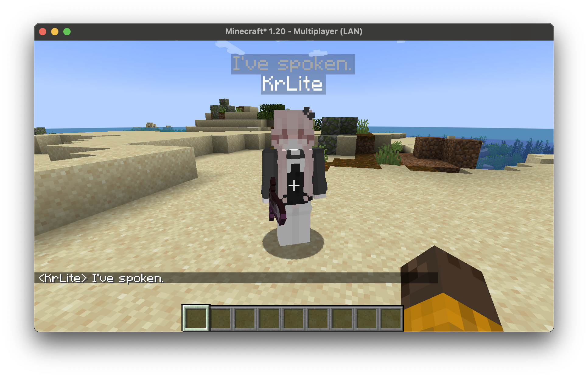

### 
[`→` Modrinth](https://modrinth.com/mod/ive-spoken)

# I've Spoken

**I've Spoken** pops a RPG-like dialog on top of one's name when he or she speaks, and lasts for about 5 seconds(configurable) before vanishing.

It's just something like this:

The content will be truncated if too long(configurable).

## Configuration

You can now configure **I've Spoken** by editing the configuration file at `/config/ive_spoken.toml`. You shall restart the game in order to reload the configurations.

## License

This repository is available under the **[GNU Public License.](LICENSE)**
